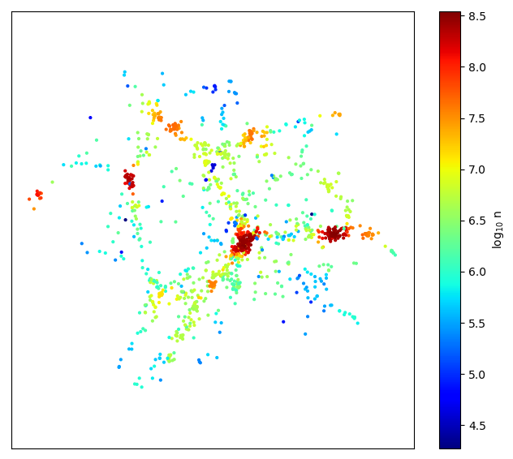

# **README** for `MBEtree`

## Contact: <garrethmartin@arizona.edu>

-----

## Purpose:

An efficient python implementation of the "modified Breiman estimator" adaptive kernel density estimation method utilising
balltree partitioning to speed up computation.
Based on a modification to [Breiman, Meisel and Purcell (1977)](https://doi.org/10.2307/1268623 "Breiman 1977") by 
[Wilkinson and Meijer (1995)](https://doi.org/10.1016/0169-2607(95)01628-7 "Wilkinson 1995") see also 
[Ferdosi et al. (2011)](https://www.aanda.org/articles/aa/abs/2011/07/aa16878-11/aa16878-11.html "Ferdosi 2011") for
applications to astronomical datasets.

Supports weighting of data and breaking calculations into chunks.

## Prerequisites:

  - numpy
  - scipy
  - sklearn

## Usage
  *inputs:*
    **X**        N-d array of positions
    **BallTree** Ff true, use balltree method for space partitioning, otherwise use KDtree method. Optional, default is true.
                 the ball tree method is generally more efficient for ndim>=3.
    **chunks**   Number of chunks to break up the calculation of densities into. This can be helpful if the number
                 of elements is large, especially when using the KDTree method. Optional, default is 1.
    **weights**  Optional weighting for each point. Optional, default is None
    
  *outputs*
    **rho**      Density at each point specified in X
    
### Example script

  `python example.py`

