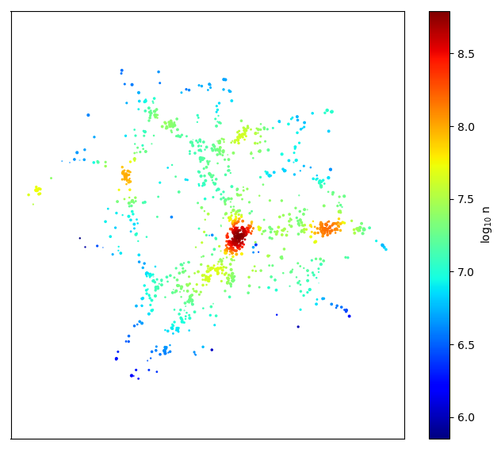

# **README** for `MBEtree`

## Contact: <garrethmartin@arizona.edu>

-----

## Purpose:

An efficient python implementation of the "modified Breiman estimator" adaptive kernel density estimation method utilising
balltree partitioning to speed up computation.
Based on a modification to [Breiman, Meisel and Purcell (1977)](https://doi.org/10.2307/1268623 "Breiman 1977") by 
[Wilkinson and Meijer (1995)](https://doi.org/10.1016/0169-2607(95)01628-7 "Wilkinson 1995") see also 
[Ferdosi et al. (2011)](https://www.aanda.org/articles/aa/abs/2011/07/aa16878-11/aa16878-11.html "Ferdosi 2011") for
applications to astronomical datasets.

## Prerequisites:

  - numpy
  - scipy
  - sklearn

## Usage
...

### Example script
'''
python example.py
'''

### 
